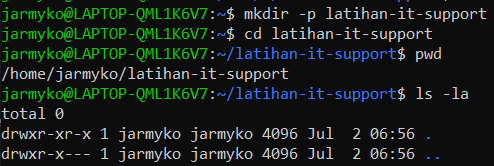
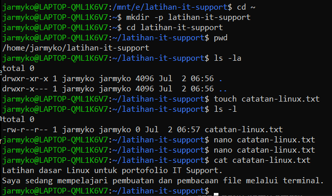
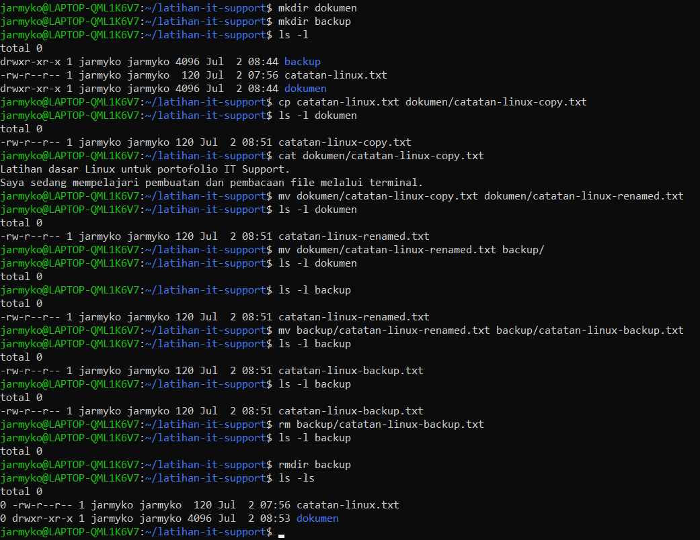
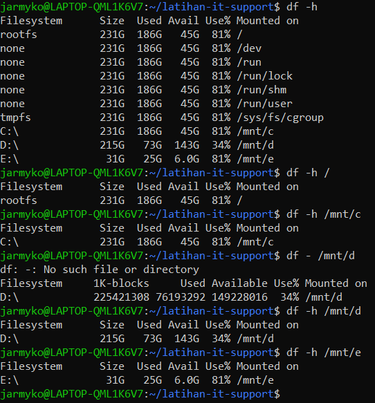
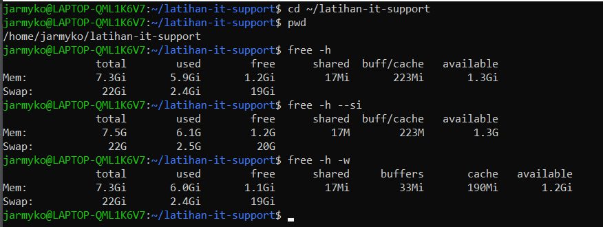
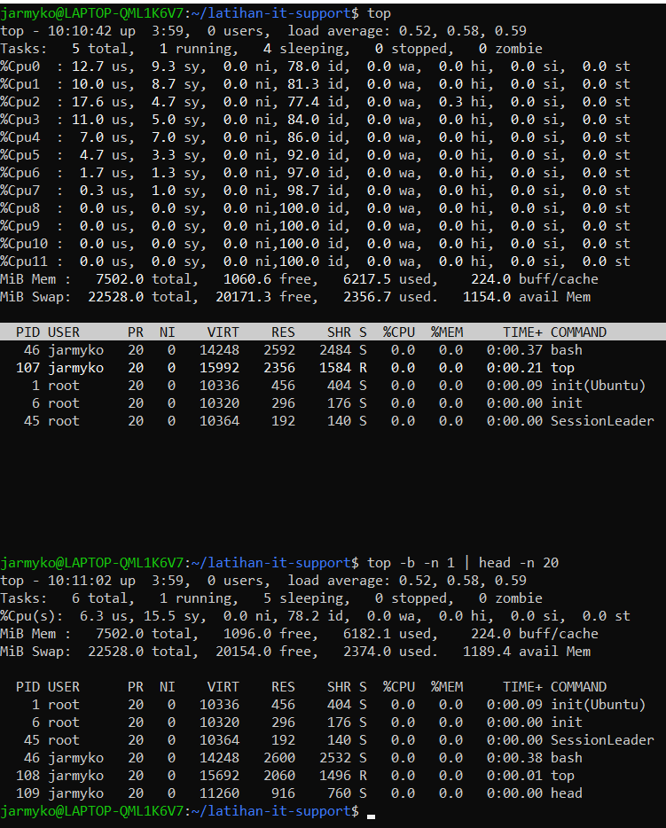

# Praktik Dasar Linux CLI

> **Status:** Dokumentasi sedang disusun  
> Praktik navigasi direktori serta pembuatan dan pembacaan file telah dilakukan. Materi lainnya masih dalam proses pembelajaran dan dokumentasi.

Dokumentasi ini mencatat latihan dasar Linux menggunakan Ubuntu melalui Windows Subsystem for Linux atau WSL.

## Tujuan Umum

Latihan ini bertujuan memahami penggunaan command dasar Linux yang relevan untuk pembelajaran IT Support, seperti navigasi direktori, pengelolaan file, dan pemeriksaan sumber daya sistem.

## Lingkungan Praktik

- Sistem operasi utama: Windows 10
- Lingkungan Linux: Ubuntu melalui WSL
- Terminal: Ubuntu Terminal
- Direktori latihan: `/home/jarmyko/latihan-it-support`

## Materi

- Navigasi direktori
- Manajemen file dan folder
- Pemeriksaan penyimpanan
- Pemeriksaan memori
- Pemeriksaan proses

---

## 1. Navigasi Direktori

### Tujuan

Memahami cara mengetahui lokasi direktori aktif, melihat isi direktori, membuat direktori baru, dan berpindah direktori.

### Command yang Digunakan

```bash
pwd
ls
ls -l
cd ~
mkdir -p latihan-it-support
cd latihan-it-support
```

### Langkah Praktik

1. Menampilkan lokasi direktori aktif:

   ```bash
   pwd
   ```

2. Menampilkan isi direktori:

   ```bash
   ls
   ```

3. Menampilkan isi direktori beserta informasi lebih terperinci:

   ```bash
   ls -l
   ```

4. Berpindah ke home directory:

   ```bash
   cd ~
   ```

5. Membuat direktori latihan:

   ```bash
   mkdir -p latihan-it-support
   ```

6. Masuk ke direktori latihan:

   ```bash
   cd latihan-it-support
   ```

7. Memastikan lokasi direktori aktif:

   ```bash
   pwd
   ```

### Hasil

Direktori `latihan-it-support` berhasil dibuat dan dapat diakses melalui terminal.

Lokasi direktori latihan:

```text
/home/jarmyko/latihan-it-support
```

### Verifikasi

Command `pwd` menampilkan lokasi `/home/jarmyko/latihan-it-support`, sedangkan `ls -l` menunjukkan bahwa direktori latihan pada awalnya masih kosong.

### Pemahaman Command

- `pwd` menampilkan lokasi direktori aktif.
- `ls` menampilkan isi direktori.
- `ls -l` menampilkan isi direktori beserta informasi yang lebih terperinci.
- `cd ~` membawa pengguna ke home directory.
- `mkdir` digunakan untuk membuat direktori.
- `cd` digunakan untuk berpindah direktori.
- Opsi `-p` pada `mkdir` memungkinkan pembuatan direktori tanpa menghasilkan error apabila direktori tersebut sudah tersedia.

### Catatan Pembelajaran

WSL dapat mengakses drive Windows melalui direktori `/mnt`.

Contoh:

- `/mnt/d` mewakili drive D Windows.
- `/mnt/e` mewakili drive E Windows.
- `/home/jarmyko` merupakan home directory Linux.

Direktori home Linux digunakan untuk latihan agar tidak bercampur dengan file pribadi pada drive Windows.

### Bukti Praktik

Screenshot navigasi direktori akan ditambahkan setelah dipilih dan dipastikan tidak menampilkan data pribadi.

### Bukti Praktik



---

## 2. Membuat, Mengedit, dan Membaca File

### Tujuan

Memahami cara membuat file kosong, mengedit isi file menggunakan text editor berbasis terminal, dan menampilkan kembali isi file.

### Command yang Digunakan

```bash
touch catatan-linux.txt
ls -l
nano catatan-linux.txt
cat catatan-linux.txt
```

### Langkah Praktik

1. Membuat file kosong menggunakan:

   ```bash
   touch catatan-linux.txt
   ```

2. Memeriksa keberadaan dan detail file menggunakan:

   ```bash
   ls -l
   ```

3. Membuka dan mengedit file menggunakan:

   ```bash
   nano catatan-linux.txt
   ```

4. Menuliskan isi berikut:

   ```text
   Latihan dasar Linux untuk portofolio IT Support.
   Saya sedang mempelajari pembuatan dan pembacaan file melalui terminal.
   ```

5. Menyimpan file dengan `Ctrl + O`, menekan `Enter`, kemudian keluar menggunakan `Ctrl + X`.

6. Menampilkan isi file menggunakan:

   ```bash
   cat catatan-linux.txt
   ```

### Hasil

File `catatan-linux.txt` berhasil dibuat, diedit, disimpan, dan dibaca melalui terminal.

### Verifikasi

Isi yang ditampilkan oleh command `cat` sama dengan teks yang sebelumnya ditulis menggunakan Nano.

### Pemahaman Command

- `touch` membuat file kosong apabila file belum tersedia.
- `ls -l` menampilkan file beserta informasi detailnya.
- `nano` merupakan text editor berbasis terminal.
- `cat` menampilkan isi file langsung ke terminal.

### Bukti Praktik



---

## 3. Menyalin, Memindahkan, Mengganti Nama, dan Menghapus File

### Tujuan

Memahami cara menyalin file, mengganti nama file, memindahkan file ke direktori lain, menghapus file, dan menghapus direktori kosong.

### Command yang Digunakan

```bash
mkdir dokumen
mkdir backup
cp catatan-linux.txt dokumen/catatan-linux-copy.txt
mv dokumen/catatan-linux-copy.txt dokumen/catatan-linux-renamed.txt
mv dokumen/catatan-linux-renamed.txt backup/
mv backup/catatan-linux-renamed.txt backup/catatan-linux-backup.txt
rm backup/catatan-linux-backup.txt
rmdir backup
ls -l
```

### Langkah Praktik

1. Membuat direktori `dokumen` dan `backup`.

   ```bash
   mkdir dokumen
   mkdir backup
   ```

2. Menyalin file `catatan-linux.txt` ke direktori `dokumen`.

   ```bash
   cp catatan-linux.txt dokumen/catatan-linux-copy.txt
   ```

3. Memastikan file salinan memiliki isi yang sama.

   ```bash
   cat dokumen/catatan-linux-copy.txt
   ```

4. Mengganti nama file salinan.

   ```bash
   mv dokumen/catatan-linux-copy.txt dokumen/catatan-linux-renamed.txt
   ```

5. Memindahkan file dari direktori `dokumen` ke direktori `backup`.

   ```bash
   mv dokumen/catatan-linux-renamed.txt backup/
   ```

6. Mengganti nama file di dalam direktori `backup`.

   ```bash
   mv backup/catatan-linux-renamed.txt backup/catatan-linux-backup.txt
   ```

7. Menghapus file latihan.

   ```bash
   rm backup/catatan-linux-backup.txt
   ```

8. Menghapus direktori `backup` setelah kosong.

   ```bash
   rmdir backup
   ```

9. Memeriksa file dan direktori yang masih tersedia.

   ```bash
   ls -l
   ```

### Hasil

File berhasil disalin, diganti namanya, dipindahkan, dan dihapus. Direktori `backup` juga berhasil dihapus setelah seluruh isinya kosong.

Struktur akhir direktori latihan:

```text
latihan-it-support/
├── catatan-linux.txt
└── dokumen/
```

### Verifikasi

- File asli `catatan-linux.txt` tetap tersedia setelah proses penyalinan.
- File salinan memiliki isi yang sama dengan file asli.
- File berhasil berpindah dari `dokumen` ke `backup`.
- Direktori `backup` menunjukkan `total 0` setelah file dihapus.
- Command `rmdir backup` berhasil karena direktori tersebut sudah kosong.

### Pemahaman Command

- `mkdir` membuat direktori baru.
- `cp` menyalin file tanpa menghapus file sumber.
- `mv` dapat digunakan untuk memindahkan atau mengganti nama file.
- `rm` menghapus file.
- `rmdir` menghapus direktori kosong.
- `ls -l` digunakan untuk memeriksa hasil setiap operasi.

### Catatan Keamanan

Command `rm` perlu digunakan dengan hati-hati karena file yang dihapus melalui terminal biasanya tidak masuk ke Recycle Bin.

### Bukti Praktik



---

## 4. Pemeriksaan Penggunaan Penyimpanan

### Tujuan

Memahami cara memeriksa kapasitas total, ruang yang telah digunakan, ruang yang masih tersedia, dan persentase penggunaan filesystem melalui terminal Linux.

### Command yang Digunakan

```bash
df -h
df -h /
df -h /mnt/c
df -h /mnt/d
df -h /mnt/e
```

### Langkah Praktik

1. Menampilkan penggunaan seluruh filesystem yang terpasang:

   ```bash
   df -h
   ```

2. Memeriksa filesystem utama Linux:

   ```bash
   df -h /
   ```

3. Memeriksa drive C Windows:

   ```bash
   df -h /mnt/c
   ```

4. Memeriksa drive D Windows:

   ```bash
   df -h /mnt/d
   ```

5. Memeriksa drive E Windows:

   ```bash
   df -h /mnt/e
   ```

### Hasil

| Lokasi | Kapasitas | Digunakan | Tersedia | Penggunaan |
|---|---:|---:|---:|---:|
| `/` | 231G | 186G | 45G | 81% |
| `/mnt/c` | 231G | 186G | 45G | 81% |
| `/mnt/d` | 215G | 73G | 143G | 34% |
| `/mnt/e` | 31G | 25G | 6.0G | 81% |

### Verifikasi

- Filesystem `/` dan drive C menunjukkan penggunaan sebesar 81%.
- Drive D memiliki penggunaan paling rendah, yaitu 34%.
- Drive E memiliki ruang kosong paling sedikit, yaitu sekitar 6 GB.
- Seluruh filesystem berhasil diperiksa menggunakan format yang mudah dibaca.

### Pemahaman Command

- `df` menampilkan penggunaan ruang penyimpanan pada filesystem.
- Opsi `-h` menampilkan ukuran dalam format yang lebih mudah dibaca.
- Kolom `Size` menunjukkan kapasitas total.
- Kolom `Used` menunjukkan ruang yang telah digunakan.
- Kolom `Avail` menunjukkan ruang yang masih tersedia.
- Kolom `Use%` menunjukkan persentase penggunaan.
- Kolom `Mounted on` menunjukkan lokasi filesystem dapat diakses.

### Analisis Dasar

Filesystem `/`, drive C, dan drive E menunjukkan penggunaan sebesar 81%. Drive E perlu lebih diperhatikan karena hanya menyisakan sekitar 6 GB, meskipun persentase penggunaannya sama dengan drive C.

Drive D masih memiliki ruang tersedia paling besar, yaitu sekitar 143 GB.

### Catatan Kesalahan

Sempat terjadi kesalahan penulisan command:

```bash
df - /mnt/d
```

Command tersebut menghasilkan pesan error karena tanda `-` tidak diikuti opsi yang valid.

Command yang benar:

```bash
df -h /mnt/d
```

### Bukti Praktik



---

## 5. Pemeriksaan Penggunaan Memori

### Tujuan

Memahami cara memeriksa penggunaan RAM, memori yang masih tersedia, cache, dan swap pada sistem Linux.

### Command yang Digunakan

```bash
free -h
free -h --si
free -h -w
```

### Langkah Praktik

1. Menampilkan penggunaan RAM dan swap dalam format yang mudah dibaca:

   ```bash
   free -h
   ```

2. Menampilkan penggunaan memori menggunakan satuan berbasis 1000:

   ```bash
   free -h --si
   ```

3. Memisahkan informasi buffer dan cache:

   ```bash
   free -h -w
   ```

### Hasil

Hasil utama dari command `free -h`:

| Informasi | Nilai |
|---|---:|
| Total RAM | 7.3 GiB |
| RAM digunakan | 5.9 GiB |
| RAM kosong | 1.2 GiB |
| Buffer dan cache | 223 MiB |
| RAM tersedia | 1.3 GiB |
| Total swap | 22 GiB |
| Swap digunakan | 2.4 GiB |
| Swap tersedia | 19 GiB |

Nilai dapat sedikit berubah karena penggunaan memori sistem berlangsung secara dinamis.

### Verifikasi

- Sistem berhasil menampilkan informasi RAM dan swap.
- Opsi `--si` menghasilkan angka yang sedikit berbeda karena menggunakan satuan berbasis 1000.
- Opsi `-w` memisahkan `buff/cache` menjadi kolom `buffers` dan `cache`.
- Nilai `buffers` sebesar 33 MiB dan `cache` sebesar 190 MiB menghasilkan total 223 MiB.

### Pemahaman Command

- `free` menampilkan penggunaan RAM dan swap.
- Opsi `-h` membuat ukuran lebih mudah dibaca.
- Kolom `total` menunjukkan total kapasitas memori.
- Kolom `used` menunjukkan memori yang sedang digunakan.
- Kolom `free` menunjukkan memori yang benar-benar kosong.
- Kolom `available` menunjukkan perkiraan memori yang masih dapat digunakan aplikasi baru.
- `buff/cache` merupakan memori yang digunakan sistem sebagai buffer dan cache.
- `Swap` merupakan ruang penyimpanan yang dapat digunakan sebagai memori tambahan.

### Analisis Dasar

Sistem belum kehabisan memori karena masih memiliki sekitar 1,3 GiB memori yang tersedia.

Namun, penggunaan RAM cukup tinggi dan swap sudah digunakan sekitar 2,4 GiB. Kondisi ini perlu dipantau apabila sistem mengalami perlambatan atau penggunaan swap terus meningkat.

### Bukti Praktik



---

## 6. Pemeriksaan Proses Aktif

### Tujuan

Memahami cara memantau proses aktif, penggunaan CPU, penggunaan memori, load average, dan kondisi sistem secara real-time.

### Command yang Digunakan

```bash
top
top -b -n 1 | head -n 20
```

### Langkah Praktik

1. Menjalankan pemantauan proses secara real-time:

   ```bash
   top
   ```

2. Mengurutkan proses berdasarkan penggunaan CPU dengan menekan:

   ```text
   P
   ```

3. Mengurutkan proses berdasarkan penggunaan memori dengan menekan:

   ```text
   M
   ```

4. Menampilkan penggunaan setiap logical CPU dengan menekan:

   ```text
   1
   ```

5. Keluar dari `top` dengan menekan:

   ```text
   q
   ```

6. Mengambil satu output statis untuk dokumentasi:

   ```bash
   top -b -n 1 | head -n 20
   ```

### Hasil

Hasil pengujian menunjukkan:

| Informasi | Hasil |
|---|---|
| Load average | 0.52, 0.58, 0.59 |
| Total proses | 5 sampai 6 |
| Proses running | 1 |
| Proses sleeping | 4 sampai 5 |
| Proses zombie | 0 |
| Logical CPU | 12 |
| CPU idle | Sekitar 78% sampai 89% |
| Proses dengan CPU tertinggi | `top`, sekitar 0.5% pada salah satu sampel |
| Proses dengan RES tertinggi | `bash` |

Jumlah proses dan penggunaan sumber daya berubah karena sistem diperbarui secara real-time.

### Verifikasi

- Tombol `P` digunakan untuk mengurutkan berdasarkan penggunaan CPU.
- Tombol `M` digunakan untuk mengurutkan berdasarkan penggunaan memori.
- Tombol `1` menampilkan CPU logis dari `Cpu0` sampai `Cpu11`.
- Tombol `q` berhasil mengembalikan tampilan ke terminal.
- Batch mode berhasil menghasilkan output statis.
- Tidak ditemukan proses dengan penggunaan CPU atau memori yang sangat tinggi.

### Pemahaman Informasi

- `PID` adalah nomor identitas proses.
- `USER` menunjukkan pengguna yang menjalankan proses.
- `S` menunjukkan status proses.
- `%CPU` menunjukkan persentase penggunaan CPU.
- `%MEM` menunjukkan persentase penggunaan RAM.
- `COMMAND` menunjukkan nama proses.
- `id` menunjukkan persentase CPU yang sedang idle.
- `load average` menunjukkan rata-rata beban sistem selama 1, 5, dan 15 menit.

### Analisis Dasar

CPU memiliki nilai idle yang cukup tinggi sehingga tidak terlihat mengalami beban berat.

Tidak ditemukan proses yang menggunakan CPU atau memori secara ekstrem. Proses `top` sempat menggunakan sekitar 0,5% CPU karena sedang melakukan pemantauan sistem.

### Bukti Praktik



---

## Pelajaran yang Diperoleh

- Linux membedakan antara home directory Linux dan drive Windows yang diakses melalui `/mnt`.
- File dapat dibuat langsung melalui terminal menggunakan `touch`.
- Nano digunakan untuk mengedit file teks dari terminal.
- Isi file dapat diverifikasi menggunakan `cat`.
- Hasil praktik perlu diperiksa sebelum dinyatakan berhasil.

## Catatan Keamanan

Screenshot yang digunakan dalam repository publik tidak boleh menampilkan:

- Password
- Token atau credential
- Alamat email pribadi
- Daftar file pribadi
- Dokumen pribadi
- Informasi sensitif lainnya

